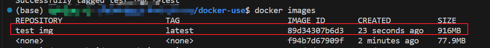
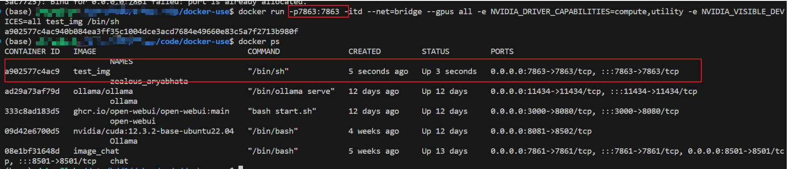
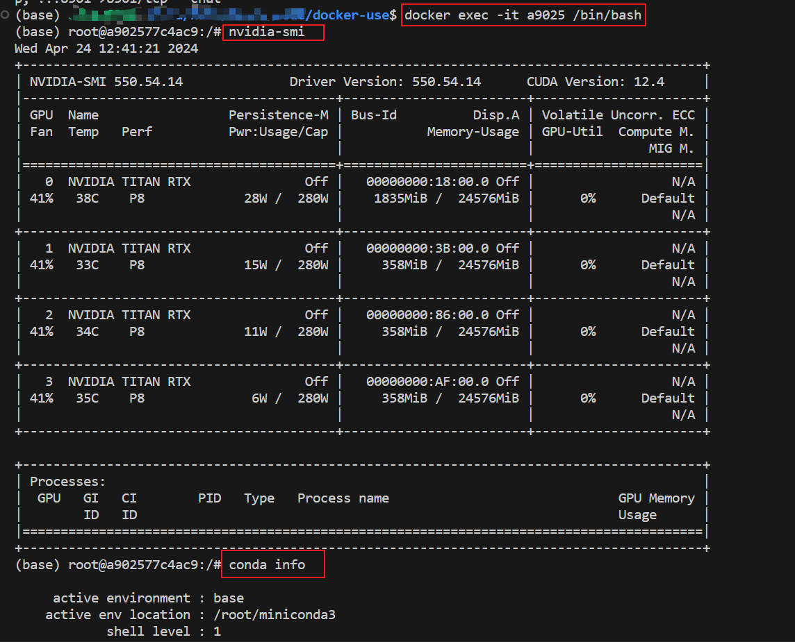
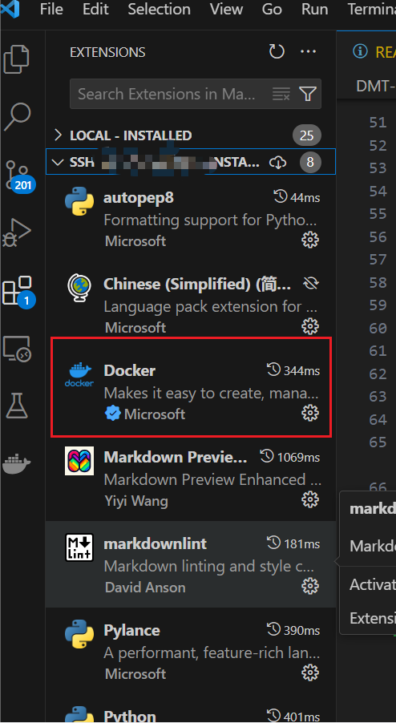
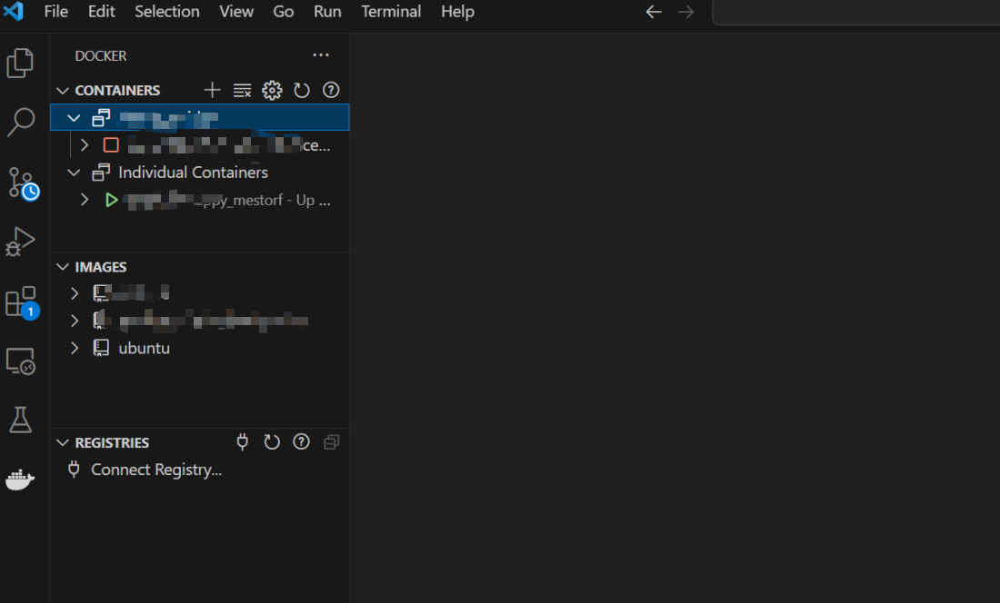
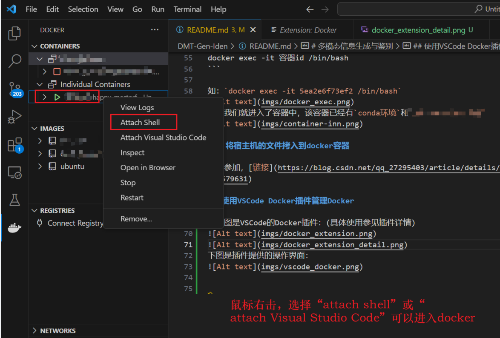
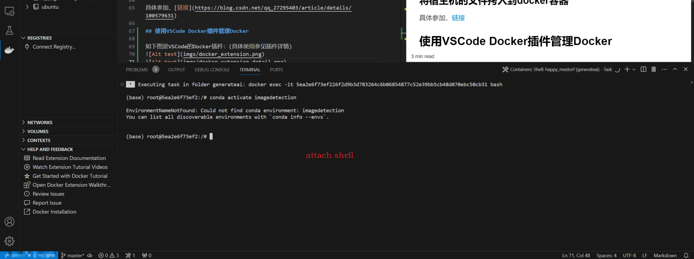

# Simple use for docker image and container

一个简单使用Docker的仓库，包括Docker环境安装（offline for ubuntu20.4）、简单的Dockerfile、简单的compose.yml以及相关指令和工具。

- [Docker离线安装](#docker离线安装)
- [Docker使用](#docker使用)
  - [创建镜像](#创建镜像)
  - [启动容器](#启动容器)
  - [进入运行中的容器](#进入一个正在运行的容器)
    - [使用docker exec](#使用docker-exec)
    - [使用docker attach](#使用docker-attach)
  - [宿主机文件拷贝到容器](#将宿主机的文件拷入到docker容器)
  - [容器commit为镜像](#将容器commit成镜像)
  - [镜像导出](#镜像导出)
  - [镜像导入](#镜像导入)
- [使用Docker Compose管理容器](#使用docker-compose管理容器启动或关闭)
  - [启动容器](#启动容器)
  - [关闭容器](#关闭容器)
- [使用VSCode Docker插件管理](#使用vscode-docker插件管理docker)

## Docker离线安装

安装`deb_for_ubuntu20`文件夹中的所有`*.deb`包，然后执行`sudo usermod -aG docker ${USER}`，最后重启并启动docker（`systemctl start docker`）。

## Docker使用

> 本文档给出项目用的几个指令，具体可以参见  
[菜鸟教程](https://www.runoob.com/docker/docker-tutorial.html)  
[菜鸟教程--Dockerfile](https://runoob.com/docker/docker-dockerfile.html)

### 创建镜像

```docker build -t {镜像名} .```  
上述命令行，表示docker会根据所在文件夹下的`Dockerfile`来编译镜像。  
如下是我们的Dockerfile内容，镜像依据ubuntu:22.04作为基准镜像，然后在其基础上又配置了conda环境。  

```bash
FROM ubuntu:22.04

# 进入root根目录环境
RUN cd ~
# 配置conda环境
RUN mkdir -p ~/miniconda3
RUN wget https://repo.anaconda.com/miniconda/Miniconda3-latest-Linux-x86_64.sh -O ~/miniconda3/miniconda.sh
RUN bash ~/miniconda3/miniconda.sh -b -u -p ~/miniconda3
RUN rm -rf ~/miniconda3/miniconda.sh

RUN ~/miniconda3/bin/conda init bash
RUN ~/miniconda3/bin/conda init zsh
```  

如我们使用`docker build -t test_img .`来生成一个名为`test_img`的镜像。在实际使用时，可根据实际情况更改镜像名。

  

### 启动一个容器  

```bash
docker run -p7863:7863 -itd --net=bridge --gpus all -e NVIDIA_DRIVER_CAPABILITIES=compute,utility -e NVIDIA_VISIBLE_DEVICES=all test_img /bin/sh
```  

上述命令，基于`test_img`生成了一个docker容器。该容器可是使用宿主机的GPU，同时将该容器的7863端口暴露给主机的7863（这样可以通过访问主机的7863端口，来访问容器的7863端口）。如下图所示：  

  

### 进入一个正在运行的容器  

> [详情参见链接](https://blog.csdn.net/Starrysky_LTL/article/details/121168670)  

本项目使用如下指令访问我们已经运行的容器，如下：  

```bash
docker exec -it 容器id /bin/bash
```

如：`docker exec -it a9025 /bin/bash`,这样我们就进入了容器中，该容器已经有`conda环境`。  
  

### 将宿主机的文件拷入到docker容器  

具体参见，[链接](https://blog.csdn.net/qq_27295403/article/details/100579631)  

### 将容器commit成镜像

```bash
# docker commit <container_id> <new_image_name>:<tag>
docker commit my_container my_new_image
```

### 镜像导出

```bash
docker save -o <output_file>.tar <new_image_name>:<tag>
# or
docker export f299f501774c > hangger_server.tar
```

### 镜像导入

```bash
docker load -i <output_file>.tar
# or
docker import my_container.tar my_image:new_tag
```

## 使用Docker Compose管理容器（启动或关闭）

### 启动容器

进入当前路径，执行命令：`docker compose up -d`，即可启动按照`compose.yml`配置，基于`demo`镜像，启动`demo-container`容器。

### 关闭容器

进入当前路径，执行命令：`docker compose down`，即可关闭`demo-container`容器。

## 使用VSCode Docker插件管理Docker

如下图是VSCode的Docker插件：(具体使用参见插件详情)  
  
下图是插件提供的操作界面：  
  
  
  
  
用`Attach Visual Studio Code`方式对使用者来说更加方便。如上就是一个docker环境的简单的使用！
