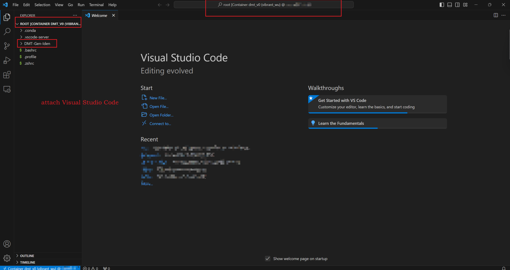

# Simple use for docker image and container

[TOC]

## Docker使用

> 本文档给出项目用的几个指令，具体可以参见  
[菜鸟教程](https://www.runoob.com/docker/docker-tutorial.html)  
[菜鸟教程--Dockerfile](https://runoob.com/docker/docker-dockerfile.html)

### 创建镜像

```docker build -t {镜像名} .```  
上述命令行，表示docker会根据所在文件夹下的`Dockerfile`来编译镜像。  
如下是我们的Dockerfile内容，镜像依据ubuntu:22.04作为基准镜像，然后在其基础上又配置了conda环境。  

```bash
FROM ubuntu:22.04

# 进入root根目录环境
RUN cd ~
# 配置conda环境
RUN mkdir -p ~/miniconda3
RUN wget https://repo.anaconda.com/miniconda/Miniconda3-latest-Linux-x86_64.sh -O ~/miniconda3/miniconda.sh
RUN bash ~/miniconda3/miniconda.sh -b -u -p ~/miniconda3
RUN rm -rf ~/miniconda3/miniconda.sh

RUN ~/miniconda3/bin/conda init bash
RUN ~/miniconda3/bin/conda init zsh
```  

如我们使用`docker build -t test_img .`来生成一个名为`test_img`的镜像。在实际使用时，可根据实际情况更改镜像名。

  

### 启动一个容器  

```bash
docker run -p7863:7863 -itd --net=bridge --gpus all -e NVIDIA_DRIVER_CAPABILITIES=compute,utility -e NVIDIA_VISIBLE_DEVICES=all test_img /bin/sh
```  

上述命令，基于`test_img`生成了一个docker容器。该容器可是使用宿主机的GPU，同时将该容器的7863端口暴露给主机的7863（这样可以通过访问主机的7863端口，来访问容器的7863端口）。如下图所示：  

  

### 进入一个正在运行的容器  

> [详情参见链接](https://blog.csdn.net/Starrysky_LTL/article/details/121168670)  

本项目使用如下指令访问我们已经运行的容器，如下：  

```bash
docker exec -it 容器id /bin/bash
```

如：`docker exec -it a9025 /bin/bash`,这样我们就进入了容器中，该容器已经有`conda环境`。  
  

### 将宿主机的文件拷入到docker容器  

具体参见，[链接](https://blog.csdn.net/qq_27295403/article/details/100579631)  

## 使用VSCode Docker插件管理Docker

如下图是VSCode的Docker插件：(具体使用参见插件详情)  
  
下图是插件提供的操作界面：  
  
  
  
  
用`Attach Visual Studio Code`方式对使用者来说更加方便。如上就是一个docker环境的简单的使用！
